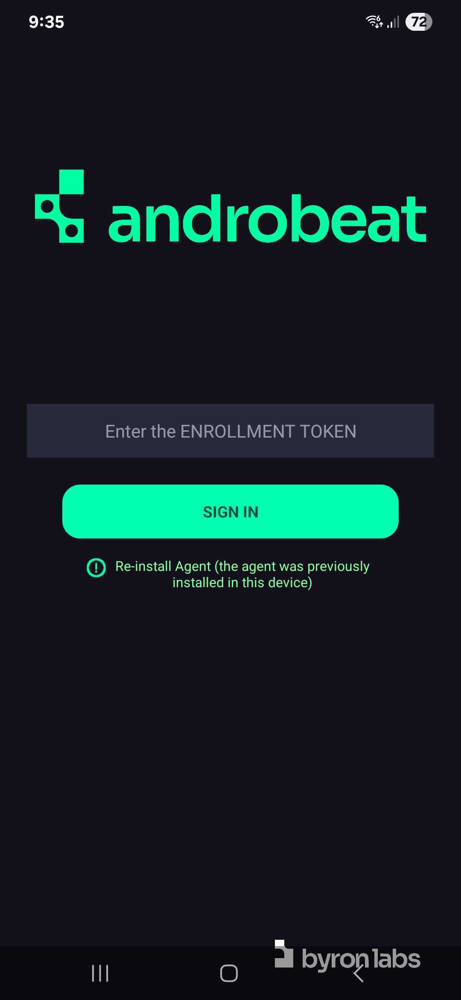
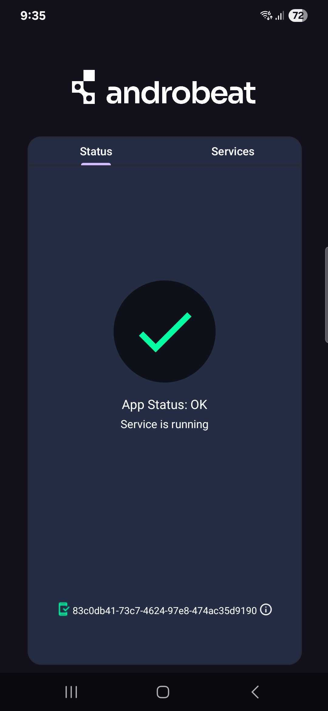
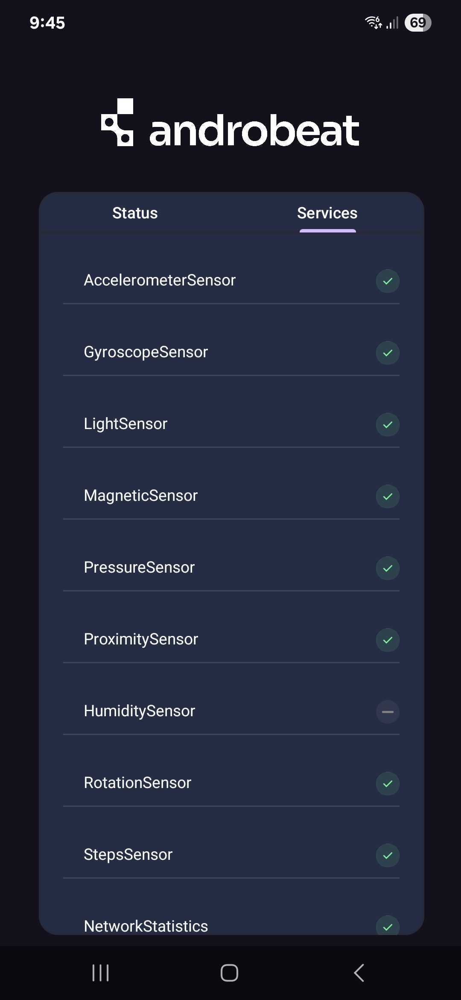

 

[](LICENSE)

## Description

**Androbeat Agent** is an Android application that collects data from an Android device and securely sends it to a Elasticsearch instance. It captures device telemetry and operational data and forwards it to Elasticsearch for storage and analysis.

## Features

- Automatic data collection from sensors and logs
- Secure data transmission to configurable servers
- Modular and extensible architecture
- Integration with Elasticsearch
- Built-in instrumentation

## Supported Sensors and Data Sources

- AccelerometerSensor
- GyroscopeSensor
- LightSensor
- MagneticSensor
- PressureSensor
- ProximitySensor
- HumiditySensor
- RotationSensor
- StepsSensor
- NetworkStatistics
- CpuStatistics
- AppStatistics
- BatteryStatistics
- WifiConnectedInfo
- WifiList
- BasicConfiguration
- CellTower
- BtList
- EnvironmentVariables
- RamStatistics

## UI/UX

Some screenshots of the application:

<p align="center">
    
</p>


## Configuration

## Data Collection Notice

The Androbeat Agent optionally requests permission from the user to collect detailed usage data in order to enhance system monitoring and analytics.  
Users can deny this permission; however, if denied, the agent will operate with limited data collection, resulting in reduced metrics being uploaded to the backend.

### Local Properties

Create a `local.properties` file in the project root with the following variables:

- `BASE_URL`: Backend base URL for Androbeat API (example: `https://10.0.2.2:8000/`)
- `LOGSTASH_URL`: Logstash input URL (local Docker example: `http://10.0.2.2:8080/`)
- `DEBUG_EXTRACTORS`: Enable/disable debug logging for data extractors (`true`/`false`)
- `DEBUG_RETROFIT`: Enable/disable debug logging for Retrofit (`true`/`false`)
- `DEBUG_SENSORS`: Enable/disable debug logging for sensors (`true`/`false`)
- `READ_LOGS`: Enable/disable reading logs (`true`/`false`)
- `ENROLLMENT_TOKEN`: Token for local authentication, requested when the application starts.

## Dependencies

Main dependencies include:

- Kotlin Coroutines
- AndroidX (Lifecycle, Compose, Navigation, etc.)
- Retrofit & OkHttp
- Dagger Hilt
- Room
- Firebase Crashlytics
- MockK & Mockito (testing)

For the full list of dependencies and their versions, see [`app/build.gradle.kts`](app/build.gradle.kts).

> **Note:** Instrumentation tests require an emulator or device with API level 26 or higher.

## Contributing

Contributions are welcome! Please open an issue or pull request and follow the [Contributing Guidelines](CONTRIBUTING.md).

## Roadmap

- [ ] Add support for more sensors
- [ ] Improve user interface
- [ ] Improve existing authentication

## License

This project is licensed under the GNU Affero General Public License v3.0 (AGPL-3.0). See [LICENSE](LICENSE) for details.
### Local Docker Stack (Logstash + Elasticsearch)

For a zero-maintenance local pipeline (`beat -> logstash -> elastic`), run:

```bash
docker compose -f docker-compose.logstash.yml up -d
```

Then configure `LOGSTASH_URL=http://10.0.2.2:8080/`.

Useful checks:

```bash
docker compose -f docker-compose.logstash.yml ps
curl http://localhost:9200
curl http://localhost:9600
```
